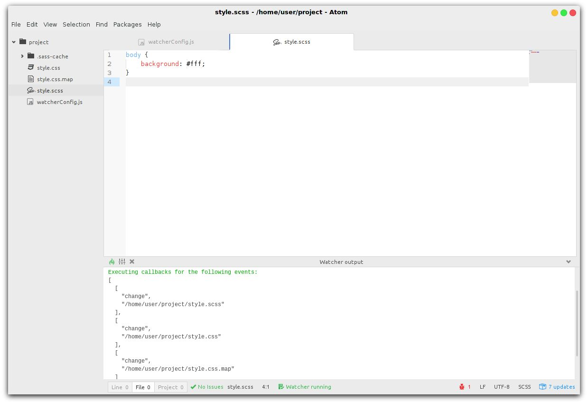

# Atom Watcher

Run user defined commands on file changes. This package utilizes the [node-watch-changes](https://www.npmjs.com/package/node-watch-changes) package and integrates it into the Atom editor.

## Installation
`apm install atom-watcher`

## Usage
Please refer to the [node-watch-changes](https://www.npmjs.com/package/node-watch-changes) package readme page for usage examples and further information.

## Troubleshooting
**For Mac users:**  
Since Atom starts with its own PATH variable, please head to the settings page of this package and specify the complete path to your Node executable.
